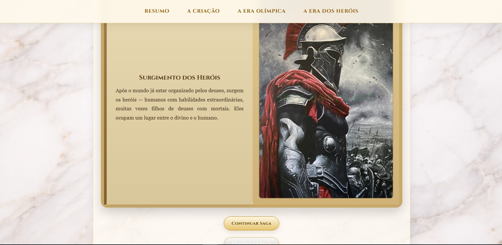
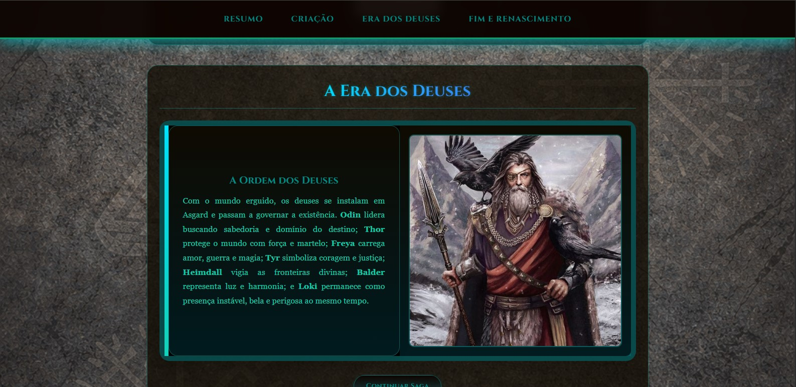

# Mitologias 

Projeto front-end desenvolvido com o objetivo de praticar HTML, CSS e JavaScript através da criação de páginas temáticas sobre diferentes mitologias do mundo.

Atualmente o site conta com 3 universos mitológicos:

- Mitologia Grega
- Mitologia Nórdica
- Mitologia Egípcia

## Mitologia Grega

## Mitologia Nórdica

## Mitologia Egípcia

## Sobre o Projeto

Cada página apresenta a história de uma mitologia em formato visual e organizado, utilizando seções, imagens, efeitos interativos e narrativa em linha do tempo.

O foco principal deste projeto é evoluir habilidades de desenvolvimento front-end, trabalhando estruturação de páginas, estilização moderna e interatividade com JavaScript.

## Tecnologias Utilizadas

- HTML5
- CSS3
- JavaScript

## Funcionalidades

- Navegação entre páginas temáticas
- Layout responsivo
- Seções organizadas por eventos históricos/lendários
- Design visual inspirado em cada cultura
- Elementos interativos

## Objetivo de Aprendizado

Este projeto foi criado para praticar:

- Estrutura semântica com HTML
- Estilização avançada com CSS
- Manipulação do DOM com JavaScript
- Responsividade
- Organização de projetos front-end
- Criação de interfaces temáticas

## Futuras Atualizações

- Adicionar novas mitologias
- Melhorar animações e transições
- Sistema de navegação global
- Modo escuro
- Mais interatividade

## Como Executar

1. Clone este repositório:

git clone https://github.com/richter06/mitologias.git

2. Abra a pasta do projeto

3. Execute o arquivo `index.html`

## Autor

Richard R. Araújo
(Richter06 no GitHub)
Estudante de ADS
